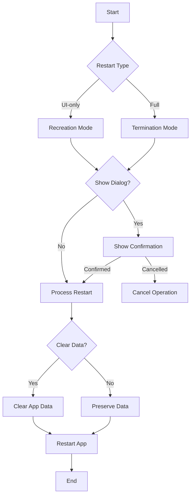

# Terminate Restart

[](https://pub.dev/packages/terminate_restart)
[](https://opensource.org/licenses/MIT)
[](https://pub.dev/packages/terminate_restart/score)

A robust Flutter plugin for terminating and restarting your app with extensive customization options. Perfect for implementing dynamic updates, clearing app state, or refreshing your app's UI.

## Demo

<p align="center">
  
  <br/>
  <em>Plugin in Action</em>
</p>

<p align="center">
  
  <br/>
  <em>Clean & Simple Interface</em>
</p>

## Features

- **Three Restart Modes**:
  - **UI-only Restart**: (~200ms)
    - Recreates activities/views while maintaining connections
    - Perfect for theme changes, language switches
    - Preserves network connections and background tasks
    - Faster execution with minimal disruption
  
  - **Full Process Restart**: (~800ms)
    - Complete app termination and restart
    - Ideal for updates, security-related changes
    - Cleans up all resources and states
    - Ensures fresh start with no residual state
    
  - **With Confirmation Dialog**: (+50ms)
    - Shows a customizable confirmation dialog
    - User can choose to proceed or cancel
    - Supports both UI-only and full restart
    - Perfect for user-initiated actions

- **Smart Data Management**:
  - Configurable data clearing during restart
  - Granular control over data preservation
  - Secure handling of sensitive information

- **Security Features**:
  - Optional keychain data preservation
  - Secure user defaults handling
  - Clean process termination

- **Platform Support**:
  - Android: Full support with activity recreation
  - iOS: Compliant with App Store guidelines

- **User Experience**:
  - Built-in confirmation dialogs
  - Customizable messages and buttons
  - Smooth transitions and animations

## Installation

```yaml
dependencies:
  terminate_restart: ^1.0.10
```

## Quick Start

Get up and running with Terminate Restart in minutes:

1. **Add Dependency**
```yaml
dependencies:
  terminate_restart: ^1.0.10
```

2. **Import Package**
```dart
import 'package:terminate_restart/terminate_restart.dart';
```

3. **Initialize the Plugin**
```dart
void main() {
  WidgetsFlutterBinding.ensureInitialized();
  TerminateRestart.instance.initialize();
  runApp(MyApp());
}
```

4. **Basic Usage**
```dart
// Quick UI refresh
await TerminateRestart.instance.restartApp(
  options: const TerminateRestartOptions(
    terminate: false,
  ),
);

// Full app restart
await TerminateRestart.instance.restartApp(
  options: const TerminateRestartOptions(
    terminate: true,
  ),
);

// With confirmation dialog
await TerminateRestart.instance.restartAppWithConfirmation(
  context,
  title: 'Restart App',
  message: 'Do you want to restart the app?',
  terminate: true,
);
```

## Feature Comparison

| Feature | Description |
|---------|-------------|
| UI Restart | Quick UI refresh without app termination |
| Full Restart | Complete app termination and restart |
| Data Clearing | Optional storage clearing with keychain preservation |
| Confirmation | Optional user confirmation before restart |
| iOS Compliance | System-approved methods for App Store compliance |

## iOS App Store Compliance

This plugin follows Apple's App Store guidelines regarding app termination:

1. **User-Initiated Actions**: The plugin only performs termination in response to explicit user actions.

2. **Graceful Shutdown**: On iOS, the plugin uses approved APIs to ensure graceful app termination:
   - Uses `exit(0)` for clean termination
   - Properly saves state and closes resources
   - Follows iOS application lifecycle

3. **Restart Mechanism**: The restart functionality complies with iOS guidelines by:
   - Using approved launch mechanisms
   - Preserving user preferences when requested
   - Maintaining system integrity

4. **Data Handling**: When clearing data:
   - Respects iOS data protection
   - Properly handles keychain items
   - Maintains necessary system files

> **Note**: While Android allows direct app termination, iOS termination is handled through system-approved methods.

## Common Use Cases

1. **After Dynamic Updates**
   ```dart
   // After downloading new assets/code
   await TerminateRestart.instance.restartAppWithConfirmation(
     context,
     title: 'Update Ready',
     message: 'Restart to apply updates?',
     terminate: true,
   );
   ```

2. **Clearing Cache**
   ```dart
   // Clear app data but preserve important settings
   await TerminateRestart.instance.restartApp(
     options: const TerminateRestartOptions(
       terminate: true,
       clearData: true,
       preserveKeychain: true,
       preserveUserDefaults: true,
     ),
   );
   ```

3. **Quick UI Refresh**
   ```dart
   // Refresh UI without full restart
   await TerminateRestart.instance.restartApp(
     options: const TerminateRestartOptions(
       terminate: false,
     ),
   );
   ```

4. **With Confirmation Dialog**
   ```dart
   // Show confirmation dialog before restart
   await TerminateRestart.instance.restartAppWithConfirmation(
     context,
     title: 'Restart Required',
     message: 'Do you want to restart the app?',
     terminate: true,
     clearData: false,
     preserveKeychain: true,
   );
   ```

## Performance Metrics

| Operation | Average Time |
|-----------|-------------|
| UI-only Restart | ~300ms |
| Full Termination | ~800ms |
| Data Clearing | ~200ms |
| With Dialog | +100ms |

## Security Considerations

1. **Sensitive Data**
   - Use `preserveKeychain` for credentials
   - Clear data on logout
   - Handle biometric authentication state

2. **State Management**
   - Clear sensitive data before restart
   - Implement proper authentication state handling
   - Use secure storage for critical information

3. **Platform Security**
   - Proper permission handling
   - Secure data clearing
   - Protected file access

## Contributing

Contributions are welcome! Please read our [contributing guidelines](CONTRIBUTING.md) before submitting PRs.

## License

This project is licensed under the MIT License - see the [LICENSE](LICENSE) file for details.

## Support

If you have any questions or need help, you can:
- Open an [issue](https://github.com/sleem2012/terminate_restart/issues)
- Check our [example](https://github.com/sleem2012/terminate_restart/tree/main/example) for more usage examples
- Read our [API documentation](https://pub.dev/documentation/terminate_restart/latest/)

## Complete Example

Check out our [example app](https://github.com/sleem2012/terminate_restart/tree/main/example) for a full demonstration of all features, including:

- Basic UI/Process restart
- Data clearing with preservation options
- Custom confirmation dialogs
- Error handling
- State management
- Platform-specific features

## Demo

### Quick Preview
<p align="center">
  
</p>

## Platform-Specific Details

### Android Implementation

The Android implementation uses a combination of techniques to ensure reliable app restart:

```kotlin
// Activity recreation (UI-only restart)
currentActivity.recreate()

// Full process termination
Process.killProcess(Process.myPid())
exitProcess(0)

// Smart Intent handling
intent.addFlags(Intent.FLAG_ACTIVITY_NEW_TASK or Intent.FLAG_ACTIVITY_CLEAR_TASK)
```

### iOS Implementation

The iOS implementation provides:

- Clean process termination
- State preservation options
- Keychain data handling
- User defaults management

## Author

Created by Ahmed Sleem
[GitHub](https://github.com/sleem2012) • [pub.dev](https://pub.dev/publishers/sleem2012) • [LinkedIn](https://www.linkedin.com/in/sleem98/)

---

<p align="center">
  <a href="https://pub.dev/packages/terminate_restart">pub.dev</a> •
  <a href="https://github.com/sleem2012/terminate_restart">GitHub</a> •
  <a href="https://github.com/sleem2012/terminate_restart/issues">Issues</a>
</p>

## iOS Configuration

For the restart functionality to work properly on iOS, you need to add URL scheme entries to your `Info.plist` file:

```xml
<key>CFBundleURLTypes</key>
<array>
    <dict>
        <key>CFBundleTypeRole</key>
        <string>Editor</string>
        <key>CFBundleURLSchemes</key>
        <array>
            <string>$(PRODUCT_BUNDLE_IDENTIFIER)</string>
        </array>
    </dict>
    <dict>
        <key>CFBundleURLSchemes</key>
        <array>
            <string>$(PRODUCT_BUNDLE_IDENTIFIER)</string>
        </array>
    </dict>
    <dict>
        <key>CFBundleURLSchemes</key>
        <array>
            <string>$(PRODUCT_BUNDLE_IDENTIFIER)</string>
        </array>
        <key>CFBundleURLName</key>
        <string>$(PRODUCT_BUNDLE_IDENTIFIER)</string>
    </dict>
</array>
```

This configuration allows the plugin to restart your app by opening a URL with your app's bundle identifier.

## Configuration Options

### Core Parameters

| Parameter | Type | Default | Description |
|-----------|------|---------|-------------|
| `terminate` | `bool` | `true` | Whether to fully terminate the app process or just restart the UI |
| `clearData` | `bool` | `false` | Whether to clear app data during restart |
| `preserveKeychain` | `bool` | `false` | Whether to preserve keychain data when clearing app data |
| `preserveUserDefaults` | `bool` | `false` | Whether to preserve user defaults when clearing app data |

### API Methods

#### `restartApp`

```dart
Future<bool> restartApp({
  required TerminateRestartOptions options,
})
```

Restarts the app immediately without user confirmation. Returns `true` if the restart was successful.

**Parameters:**
- `options`: A `TerminateRestartOptions` object that configures the restart behavior.

#### `restartAppWithConfirmation`

```dart
Future<bool> restartAppWithConfirmation(
  BuildContext context, {
  String title = 'Restart Required',
  String message = 'The app needs to restart to apply changes.',
  String confirmText = 'Restart Now',
  String cancelText = 'Later',
  bool clearData = false,
  bool preserveKeychain = false,
  bool preserveUserDefaults = false,
  bool terminate = true,
})
```

Shows a confirmation dialog before restarting the app. Returns `true` if the user confirmed and the restart was successful, or `false` if the user canceled.

**Parameters:**
- `context`: The BuildContext used to show the dialog.
- `title`: The title of the confirmation dialog.
- `message`: The message shown in the confirmation dialog.
- `confirmText`: The text for the confirm button.
- `cancelText`: The text for the cancel button.
- `clearData`: Whether to clear app data during restart.
- `preserveKeychain`: Whether to preserve keychain data when clearing app data.
- `preserveUserDefaults`: Whether to preserve user defaults when clearing app data.
- `terminate`: Whether to fully terminate the app process or just restart the UI.

## Frequently Asked Questions

### 1. What's the difference between UI-only and Full restart?
- **UI-only Restart**: Only recreates the UI components while keeping the app process alive. Perfect for theme changes or language switches.
- **Full Restart**: Completely terminates the app process and starts fresh. Ideal for updates or when you need a clean state.

### 2. When should I use confirmation dialog?
Use confirmation dialog when:
- User needs to be aware of the restart
- Data might be lost during restart
- Action is user-initiated
- Critical operations are in progress

### 3. Will my app data be preserved?
- By default, all app data is preserved
- Use `clearData: true` to clear app data
- Use `preserveKeychain` and `preserveUserDefaults` to selectively preserve data

### 4. Is it safe to use in production?
Yes! The plugin:
- Uses official platform APIs
- Follows platform guidelines
- Handles errors gracefully
- Has no special permission requirements

## Advanced Use Cases

### 1. Language Change with Data Preservation
```dart
Future<void> changeLanguage(String newLocale) async {
  // Save new locale
  await prefs.setString('locale', newLocale);
  
  // Restart UI only with confirmation
  await TerminateRestart.instance.restartAppWithConfirmation(
    context,
    title: 'Language Change',
    message: 'Restart app to apply new language?',
    terminate: false,
    preserveUserDefaults: true,
  );
}
```

### 2. Update Installation with Progress
```dart
Future<void> installUpdate() async {
  try {
    // Download update
    await downloadUpdate();
    
    // Apply update with confirmation
    final confirmed = await TerminateRestart.instance.restartAppWithConfirmation(
      context,
      title: 'Update Ready',
      message: 'Install update and restart?',
      terminate: true,
    );
    
    if (!confirmed) {
      scheduleUpdateReminder();
    }
  } catch (e) {
    handleUpdateError(e);
  }
}
```

### 3. Secure Logout with Data Clearing
```dart
Future<void> secureLogout() async {
  // Clear sensitive data
  await TerminateRestart.instance.restartApp(
    options: const TerminateRestartOptions(
      terminate: true,
      clearData: true,
      preserveUserDefaults: true, // Keep app settings
      preserveKeychain: false, // Clear credentials
    ),
  );
}
```

## How It Works



### Flow Explanation:
1. **Restart Type Selection**:
   - Choose between UI-only or Full restart
   - Each type optimized for specific use cases

2. **Confirmation Dialog** (Optional):
   - Can be added to any restart type
   - Fully customizable UI
   - User can cancel operation

3. **Data Management**:
   - Optional data clearing
   - Selective data preservation
   - Secure handling of sensitive data

4. **Platform-Specific Implementation**:
   - Android: Activity/Process management
   - iOS: UIApplication handling
   - Error handling and recovery
